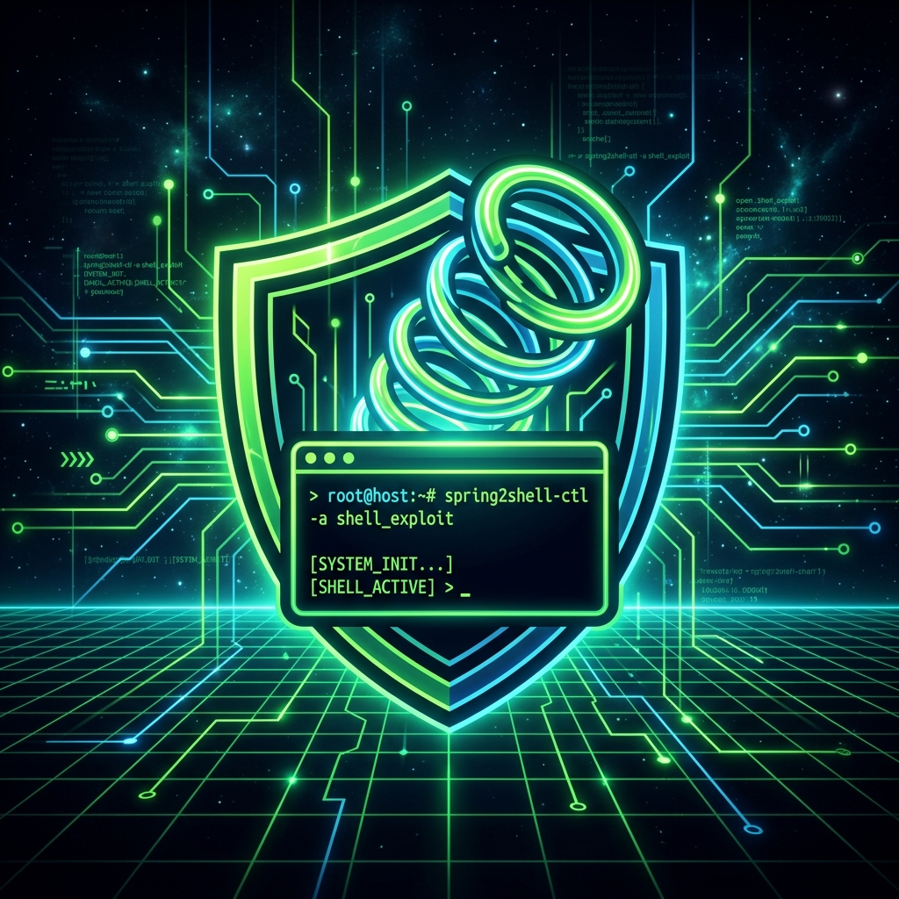
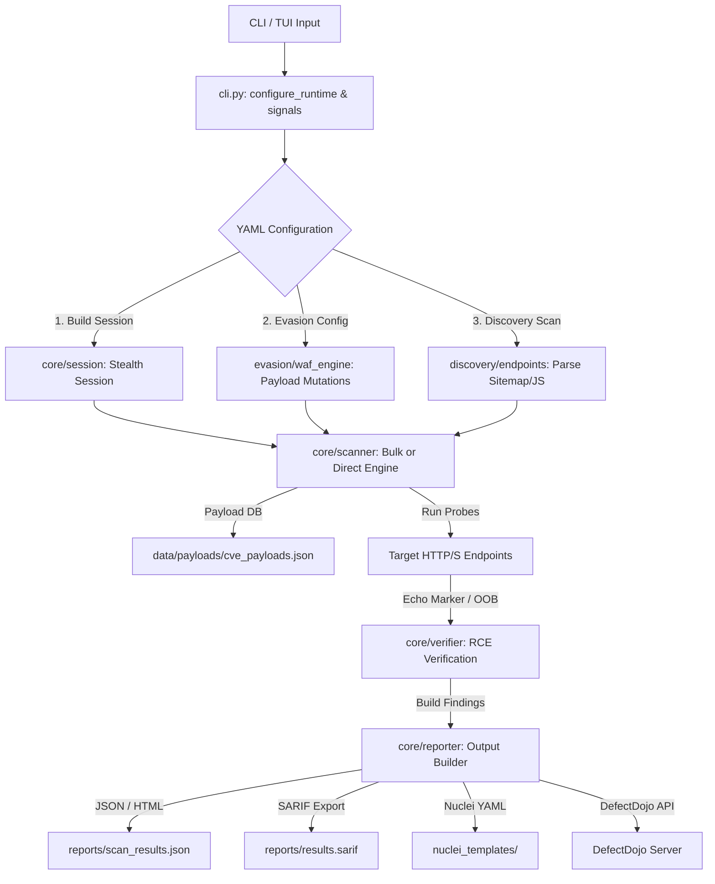

<p align="center">
  
</p>

<h1 align="center">⚡ Spring2Shell ⚡</h1>

<p align="center">
  <strong>A premium, modular vulnerability scanner and exploitation framework targeting Spring, GraphQL, and React Server Components (RSC) stacks.</strong>
</p>

<p align="center">
  <a href="https://python.org"></a>
  <a href="https://github.com/C00LN3T/Spring2Shell/releases"></a>
  <a href="file:///home/arch/WORKSPACE/WORK/PROJECTS/Spring2Shell-1/LICENSE"></a>
  <a href="https://linux.org"></a>
  <a href="https://github.com/astral-sh/ruff"></a>
  <a href="#automated-tests"></a>
</p>

---

## 📖 Table of Contents
- [✨ Key Features](#-key-features)
- [⚙️ Architecture & Data Flow](#️-architecture--data-flow)
- [🛡️ CVE & Vulnerability Coverage Matrix](#️-cve--vulnerability-coverage-matrix)
- [🚀 Installation & Setup](#-installation--setup)
- [💻 CLI Usage Guide](#-cli-usage-guide)
  - [Global Flags](#global-flags)
  - [Subcommands](#subcommands)
- [🖥️ Interactive TUI Menu](#️-interactive-tui-menu)
- [🛠️ Developer Workflows (Makefile)](#️-developer-workflows-makefile)
- [⚖️ Legal & Ethical Warning](#️-legal--ethical-warning)

---

## ✨ Key Features

- **🚀 Dual-Engine Execution**: High-concurrency `async` network engine (powered by `aiohttp`) for bulk scans, alongside a robust synchronous thread-pool worker engine.
- **🕵️ Deep Endpoint Discovery**: Parses `sitemaps`, processes `__NEXT_DATA__` structures inside Next.js pages, extracts React Server Action mappings (`Next-Action`), analyzes JavaScript routes, and tests actuator/GraphQL paths.
- **👺 Advanced WAF Evasion**: Dynamic header randomization, junk query parameters/body padding, Base64 & Hex payload mutations, character encoding bypasses, and intelligent rate limiting (jitter).
- **🔎 Safe Auditing Modes**: Fully passive checks (no commands executed) testing for vulnerable encoding behaviors, configuration leakage (e.g. Actuators, log4j core libraries), and estimation of Log2Shell/Log4Shell risks.
- **📡 OOB & Blind Verification**: Fully integrates with self-hosted `Interactsh` OOB servers to detect blind RCE via DNS/HTTP call-backs, plus dual-marker echo validation.
- **🔌 Enterprise Reporting & Integrations**: Generates clean TXT, JSON, HTML (interactive charts), and SARIF files. Easily uploads scan data to **DefectDojo** or exports templates into **Nuclei v3** format.

---

## ⚙️ Architecture & Data Flow

`Spring2Shell` uses a clean **src-layout package** structure separating core logic, payloads, configuration profiles, and reporting:

```
src/spring2shell/
├── cli.py             # Argparse dispatching & runtime bootstrapping
├── core/              # Scan engine, exploiter, OOB, and reporter logic
├── discovery/         # Sitemap/JS analyzers, actuator/GraphQL endpoint lists
├── evasion/           # WAF engine, header generators, payload mutation
├── audit/             # Passive auditing & Log4j dependency analyzers
├── react2shell/       # Next.js Server Actions & React RSC scanning
└── utils/             # DefectDojo upload, Nuclei exporting, auth, network helpers
```

### 🔁 Execution Pipeline
The diagram below details the data flow from command execution to final reporting:



---

## 🛡️ CVE & Vulnerability Coverage Matrix

`Spring2Shell` contains an externalized, up-to-date payload database (`data/payloads/cve_payloads.json`) targeting the following vectors:

| CVE ID | Vulnerability / Description | Affected Technology | Type | Variants |
| :--- | :--- | :--- | :--- | :---: |
| **CVE-2025-55182** | SpEL Injection (GraphQL/Spring Endpoints) | Spring Framework | Remote Code Execution | 8 |
| **CVE-2025-66478** | GraphQL-specific SpEL injection vectors | Spring + GraphQL | Remote Code Execution | 3 |
| **CVE-2022-22965** | Spring4Shell (ClassLoader Data Binding RCE) | Spring Framework | Remote Code Execution | 2 |
| **CVE-2021-44228** | Log4Shell (JNDI LDAP/RMI Injection) | Apache Log4j 2 | Remote Code Execution | 6 |
| **CVE-2022-42889** | Text4Shell (Commons Text Interpolation) | Apache Commons Text | Remote Code Execution | 3 |
| **CVE-2023-46604** | ActiveMQ OpenWire Deserialization RCE | Apache ActiveMQ | Remote Code Execution | 4 |
| **CVE-2024-22243** | Spring Web SSRF via UriComponentsBuilder | Spring Framework | SSRF | 7 |
| **CVE-2024-38816** | WebFlux Directory Traversal (Linux pathing) | Spring Framework | Path Traversal | 7 |
| **CVE-2024-4577** | PHP CGI Argument Injection (Windows/XAMPP) | PHP CGI | Remote Code Execution | 4 |
| **CVE-2023-34104** | fast-xml-parser ReDoS / Prototype Pollution | fast-xml-parser | ReDoS / Pollution | 3 |
| **CVE-2024-21626** | runc Container Escape (/proc/self/fd leak) | runc | Container Escape | 3 |

---

## 🚀 Installation & Setup

Ensure you have **Python 3.8+** installed. Set up the environment using the virtual environment helper:

```bash
# Clone the repository
git clone https://github.com/C00LN3T/Spring2Shell.git
cd Spring2Shell-1

# Create and activate virtual environment
python3 -m venv .venv
source .venv/bin/activate

# Install development dependencies and editable package
make install-dev
```

---

## 💻 CLI Usage Guide

### Global Flags
These arguments apply to all subcommands and modify connection and diagnostic behaviors:
* `--insecure`: Disables TLS certificate validation (not recommended).
* `--verbose-errors`: Logs swallowed network exceptions to screen for diagnostics.
* `--profile {default,aggressive,safe-audit,stealth}`: Selects connection timeout, retry limits, and delays.
* `--dry-run`: Performs a dry-run showing what payloads and paths WOULD be sent, without making network requests.
* `--proxy URL`: Directs traffic through HTTP/SOCKS5 proxy (e.g. `http://127.0.0.1:8080` or `socks5://127.0.0.1:9050`).
* `--rate N`: Throttles scanner to a maximum of `N` requests per second (`0` = unlimited).
* `--config FILE`: Custom config path (defaults to `./config.yaml` if it exists).

---

### Subcommands

#### 1. Passive Security Audit (`safe-audit`)
Runs passive encoding checks, exposed actuators, and misconfiguration scans without exploiting.
```bash
spring2shell safe-audit https://target.example -o reports/audit.json --html-report
```

#### 2. Log4j Dependency Leak Audit (`log-audit`)
Checks exposed paths and class definitions to estimate Log2Shell / Log4Shell risks.
```bash
spring2shell log-audit https://target.example -o reports/log_audit.json
```

#### 3. Single Target Exploitation (`direct`)
Launches direct exploitation against a single host. You can customize the command payload or scope.
```bash
# Auto-detect endpoints and execute command
spring2shell direct https://target.example --find-endpoints -c "whoami"

# Exploit a specific endpoint using aggressive WAF bypass mutations
spring2shell direct https://target.example -e /api/graphql -c "id" --aggressive
```

#### 4. Bulk Target Scanner (`scan`)
Scans a list of target URLs. Supports resuming from checkpoints, report formatting, and encryption.
```bash
# Run scan with 15 concurrent threads, generate JSON/TXT/HTML reports, and encrypt output
spring2shell scan targets.txt reports/bulk_run -t 15 --html-report --encrypt-reports
```

#### 5. High-Concurrency CVE Mass Scan (`cve-scan`)
Runs targeted CVE-specific probes across a targets list using the high-performance async engine.
```bash
spring2shell --rate 30 cve-scan targets.txt -o reports/cve_mass.json --async
```

#### 6. SSRF & SSTI Specialized Probes (`ssrf-scan` / `ssti-scan`)
Scans target for Server-Side Request Forgery or Server-Side Template Injection vulnerabilities.
```bash
spring2shell ssrf-scan https://target.example -o reports/ssrf.json --html-report
spring2shell ssti-scan https://target.example -o reports/ssti.json
```

#### 7. Web Application Firewall Profiler (`profile-waf`)
Safely tests target behaviors to determine which characters/HTTP methods trigger WAF blocks.
```bash
spring2shell profile-waf https://target.example -o reports/waf_profile.json
```

#### 8. Verify Vulnerability (`verify`)
Reruns an echo-marker and blind time-delay check to verify if a reported finding is an active vulnerable endpoint.
```bash
spring2shell verify https://target.example -e /api/graphql --method POST
```

#### 9. Export Findings to Nuclei Templates (`nuclei-export`)
Converts findings in a JSON report into custom Nuclei v3 YAML templates.
```bash
spring2shell nuclei-export reports/bulk_run_combined.json nuclei_templates/
```

#### 10. DefectDojo Integration (`defectdojo-upload`)
Uploads scan results directly to your DefectDojo console.
```bash
spring2shell defectdojo-upload reports/bulk_run_combined.json \
  --url https://defectdojo.corp.internal \
  --api-key "APITOKENEXAMPLE12345" \
  --engagement-id 42
```

---

## 🖥️ Interactive TUI Menu

Run the terminal user interface menu to drive discovery, auditing, and exploitation interactively:
```bash
spring2shell menu
```

### Menu Structure
```
======================================================================
ULTIMATE REACT4SHELL / REACT2SHELL FRAMEWORK
CVE-2025-55182, CVE-2025-66478, Log4Shell, Spring4Shell, Text4Shell
======================================================================
  1.  Scan new targets (bulk)              ← Enter target file and threads
  2.  Load and exploit from existing report  ← Feed JSON report to shell driver
  3.  Direct exploitation (manual target)    ← Target URL, endpoint, and command
  4.  Verify RCE (echo-marker + blind test)  ← In-depth active vulnerability verify
  5.  Aggressive exploitation (WAF bypass)  ← Focuses mutations & encoding bypasses
  6.  CVE-specific scan                      ← Run precise payload tests on target
  7.  Find working endpoints (quick probe)   ← Run endpoint checkers
  8.  Safe full audit (encoding + logs + deps)← Aggregates non-intrusive risk checks
  9.  Log4Shell risk audit                   ← Run passive Log4j checks
  10. React2Shell probe                      ← Specific Next.js/React SA check
  11. SSRF scan                              ← Out-of-band/local SSRF probing
  12. SSTI scan                              ← Template injection payload scans
  13. Exit                                   ← Close TUI
```

---

## 🛠️ Developer Workflows (Makefile)

Ensure code quality, execute tests, and manage local deployments using the configured `Makefile` targets:

* **Setup Development Environment**:
  ```bash
  make venv
  source .venv/bin/activate
  make install-dev
  ```
* **Linting & Code Formatting** (uses `ruff` for fast linting/formatting checks):
  ```bash
  make lint       # Inspect codebase
  make format     # Reformat code automatically
  ```
* **Type checking**:
  ```bash
  make typecheck  # Run mypy static type checking
  ```
* **Running Tests** (runs 247 unit tests and generates code coverage report):
  ```bash
  make test       # Full suite with coverage
  make test-unit  # Unit tests only
  ```

---

## ⚖️ Legal & Ethical Warning

> [!WARNING]
> **This tool is for authorized penetration testing and security research only.**  
> Scanning or attempting to exploit targets without explicit, written, prior authorization from the system owner is a criminal offense in most jurisdictions. The developers assume no liability and are not responsible for any misuse, damage, or legal consequences resulting from this tool.
